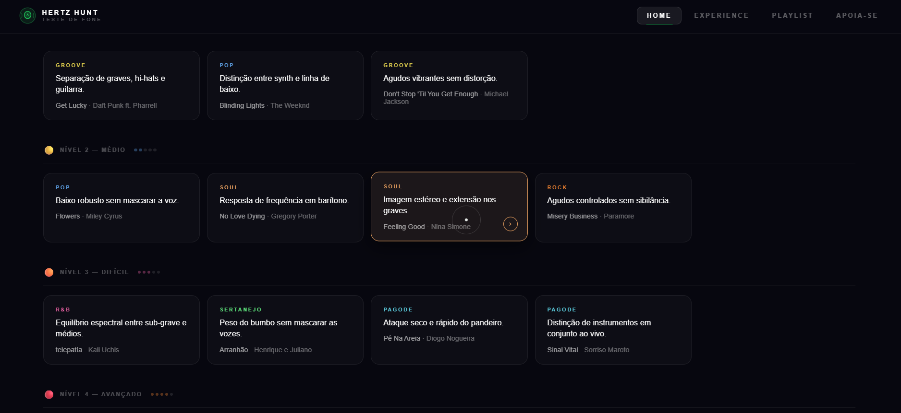

# HertzHunt

[Português](README.pt-BR.md) | [English](README.md)

<p align="center">
  
</p>

<p align="center">
  <em>Reviews subjetivos de áudio não são suficientes. Eu precisava de um sistema para realmente testar o hardware ao limite.</em><br>
  Empresas testam fones com equipamentos complexos de laboratório. <strong>O HertzHunt te dá as faixas e os parâmetros exatos para você mesmo testá-los.</strong>
</p>

<p align="center">
  
  
  
  
  
  
</p>

---

## O Que é Isso?

O **HertzHunt** é uma aplicação web imersiva e interativa projetada para levar fones de ouvido ao seu limite absoluto. Em vez de apenas ouvir música e adivinhar se o seu equipamento é bom, o HertzHunt te guia por um pipeline de avaliação gamificado e com múltiplos níveis.

Seja você um audiófilo, um revisor de tecnologia testando novos headsets ou apenas alguém curioso sobre o seu fone do dia a dia, este app fornece um diagnóstico definitivo.

> **Nota:** O sistema utiliza streaming de áudio de alta qualidade. Para obter os resultados mais precisos, certifique-se de que os aprimoramentos de áudio do seu dispositivo (como áudio espacial ou equalizadores) estejam desligados durante o teste.

## Recursos Principais

| Recurso | Descrição |
|---------|-------------|
| 🎵 **Seleção Curada** | 20 faixas escolhidas especificamente para isolar frequências (sub-graves, sibilância, clareza dos médios). |
| 📈 **5 Níveis de Dificuldade** | Testes progressivos desde o Nível 1 (Aquecimento / Separação Básica) até o Nível 5 (Transições Dinâmicas Extremas). |
| 📊 **Relatório Diagnóstico** | Um boletim interativo pós-teste avaliando seu hardware em Graves, Médios e Agudos, com insights personalizados. |
| 🎛️ **UI Customizada do Player** | Interface imersiva com discos de vinil animados, visualizadores de ondas customizados e links diretos para o Spotify. |
| ☁️ **Streaming na Nuvem** | Áudio armazenado e transmitido de forma segura via Supabase para reprodução sem latência e um código leve. |
| 📱 **Design Responsivo** | Totalmente otimizado para visualização em celulares, tablets e desktops. |

## Como Funciona

```text
Selecione um Desafio (Níveis 1-5)
        │
        ▼
Ouça & Avalie → O app faz uma pergunta técnica específica (ex: "O sub-grave abafa as vozes?")
        │
        ▼
Classifique a Performance → De 1 a 5 estrelas com base em clareza e distorção
        │
        ▼
Geração do Diagnóstico → O algoritmo calcula as pontuações e gera uma matriz de performance detalhada
```

## Início Rápido (Execução Local)

O HertzHunt foi construído com uma arquitetura frontend pura, sem dependências. Não são necessários `node modules` ou etapas de build.

```bash
# 1. Clone o repositório
git clone [https://github.com/samu-lls/hertz-hunt.git](https://github.com/samu-lls/hertz-hunt.git)

# 2. Acesse a pasta do projeto
cd hertz-hunt

# 3. Sirva os arquivos
# Você pode usar o Live Server do VS Code ou qualquer servidor HTTP simples:
npx serve .
```

## Estrutura do Projeto

```text
hertz-hunt/
├── css/
│   └── style.css          # Estilos customizados, animações e grids responsivos
├── js/
│   └── script.js          # Lógica principal, manipulação do DOM, Player e Algoritmo de nota
├── index.html             # Ponto de entrada principal e layout estrutural
└── README.md
```

## Tecnologias Utilizadas

- **Frontend:** HTML5 puro, CSS3 e Vanilla JavaScript. Sem frameworks pesados.
- **Backend / Armazenamento:** [Supabase](https://supabase.com/) Public Buckets para streaming de áudio rápido e confiável.
- **Hospedagem / CI-CD:** [Vercel](https://vercel.com/) para deploys automatizados.
- **Módulo de Feedback:** [EmailJS](https://www.emailjs.com/) para submissões de formulário diretas e *serverless*.

## Sobre o Autor

Sou o **Samuel**, Analista de TI e entusiasta de tecnologia. Passo boa parte do tempo fazendo reviews de tecnologia, testando periféricos e analisando performance de hardware. Construí o HertzHunt porque precisava de uma maneira padronizada e repetível de testar equipamentos de áudio além do simples "parece bom".

Se quiser bater um papo sobre tecnologia, setups ou desenvolvimento de software, vamos nos conectar.

## Vamos nos Conectar

[](https://www.linkedin.com/in/samu-lls/)
[](https://www.behance.net/samuellelles)
[](mailto:samu.lls@outlook.com)
[](https://github.com/samu-lls)

## Licença

Este projeto está licenciado sob a Licença MIT - veja o arquivo [LICENSE](LICENSE) para detalhes.